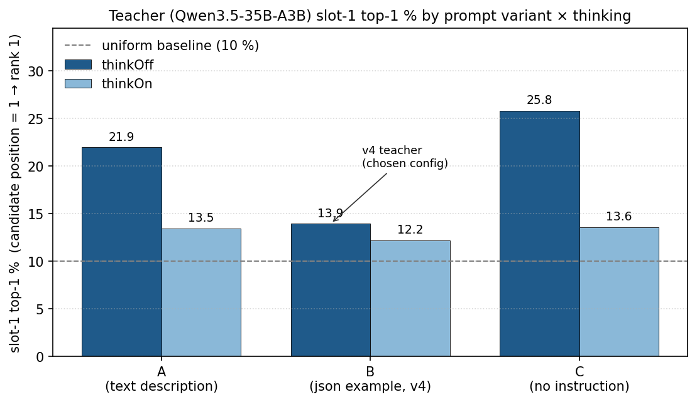
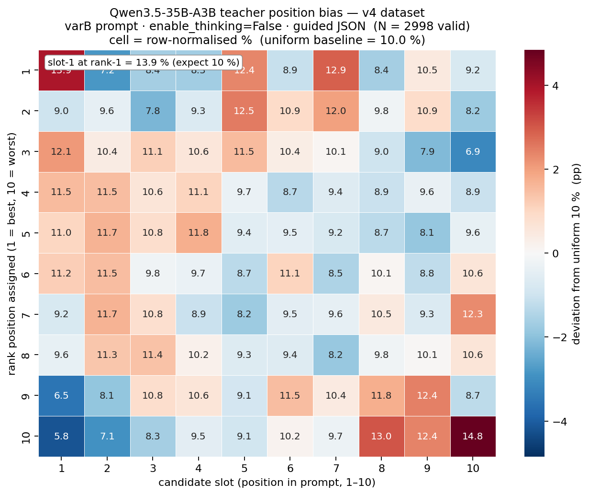

# LLM Distillation & Quantization — 한계 탐색 리포트

# 0. 프로젝트 동기
LLM 분야에서 Distillation과 Quantization은 로컬 실행, 추론 비용 절감, 엣지 배포를 위해 거의 기본 옵션처럼 이야기된다. 그러나 개인적인 경험에서 이 기법들은 모든 상황에서 동작하는 마법은 아니었다.
그래서 이 프로젝트는 "Qwen3.5 35B-A3B → 0.8B / 9B"라는 구체적인 teacher-student 페어를
두고 **같은 목표 태스크, 여러 학습/양자화 조합**을 돌려보며 각 기법의 **실제 장단점**을 수치와 관찰로 기록하는 것을 목표로 했다. 예상 작업 기간은 1주였고, 초기 스코프는 다음과 같이 잡았다:
1. **Off-policy distillation** — Qwen3.5-35B-A3B로 만든 teacher label로 0.8B/9B SFT후에 Latency, retrieval 지표, LLM-as-a-Judge를 모두 비교.
2. **On-policy distillation (GKD)** — 같은 pair에 on-policy 학습을 적용한 후 비교.
3. **Quantization** — 증류된 student에 W4A16 / NF4 / GGUF Q4_K_M을 적용해 성능/Latency trade-off를 측정.

vLLM의 continuous batching, FlashInfer를 적극적으로 사용해 실제 production-like 조건에서의 거동을 확인.
연세대학교 데이터센터의 GPU를 slurm으로 할당 받아 진행했고, QAT / QAD 같은 training-time fake-quant는 이번 스코프에서 제외했다.

---
# 1. 태스크 & 데이터셋 선정
Yelp Open Dataset 기반의 "유저의 방문 history → 다음에 방문할 후보를 10개 중 re-rank" 하도록 구성했다. 데이터 셋은 `scripts/data/preprocess_yelp.py` 가 원본 JSON 5 개 (`business`, `review`, `user`, `tip`, `checkin`) 에서 생성한다:

- **필터**: city = Philadelphia + food/place 관련 20 개 카테고리 + in-city 리뷰 ≥ 8 건 유저만 남김.
- **샘플 빌드**: 유저의 in-city 리뷰를 시간순으로 정렬하고 **가장 최근 1 건을 held-out positive** 로 분리. 남은 리뷰는 chronological `history` (최대 20 개 cap; p99 = 187, max = 516 이지만 컷해서 토큰 분포 좁힘).
- **Negatives**: 유저가 **한 번도 방문한 적 없는** in-city food business 9 건 (`rng.sample(seed=42)`, visited 판정은 truncation 이전 전체 이력 기준 → leak 없음).
- **Shuffle**: `[positive, *negatives]` 을 섞어 정답 위치 leakage 차단.

결과 스키마 (`data/processed/philly_samples.jsonl`, N = 3,000, train 2,713 / eval 287 의 9:1 split):
```
sample_id, user_id, city
history: list of past visits
↳ business_id, name, categories, stars, review_snippet, date
candidates: list of 10 shuffled candidates
↳ business_id, name, categories, attributes, avg_stars, review_count
positive_business_id: ground-truth next visit (held out)
```
데이터가 명확하고 single-label이라 **Listwise Reranker**로 깔끔히 파이프라인을 짤 수 있었고, retrieval 지표(R@k, MRR, NDCG, Kendall τ)와 rationale 품질(LLM-as-Judge)을 동시에 측정하기 좋았다. `--seed 42` 를 고정해 동일 seed + 인자면 같은 `sample_id` + negative 집합이 재현된다.

## 1.1 History Token 분포 분석 — 처음에 놓친 지점
처음에는 SFT max_length를 관성적으로 2048로 잡았는데, prompt 자체가 이미 2048을 초과하는 경우가 많았다. 4096으로 올렸지만 여전히 15%가 drop. Yelp 전체 샘플에서 history 길이를 뽑아보니:
```

history items per user (N=3000)

  mean=23.6  p50=12  p75=23  p90=49  p95=79  p98=130  p99=187  max=516

```

최대 516 items는 단독으로 33,540 tokens를 먹는다. **history cap=20**을 두면 초과하지 않는다는 것을 확인하고 이 설계를 채택했다.

## 1.2 Schema 설계 실수 — `business_id` → `candidate_index`
초기 prompt에서는 teacher가 ranking을 `business_id` 리스트로 반환하도록 했다.
그런데 Qwen3.5-35B teacher가 vLLM guided JSON 하에서 **22자 해시 ID**를 안정적으로 복붙하지 못했다 — 2980개 응답 중 982개에서 business name이 섞여 나오거나 ID가 잘못 복제됐다.

원인은 단순했다: business_id는 모델이 기억할 이유가 없는 긴 token sequence이고, MMLU 등의 ranking에서 기본으로 쓰는 형식은 "`1`, `2`, ... `10`" 등의 인덱스 형식이다.
설계 단계에서 한 번만 뒤집어봤으면 피할 수 있었던 문제였고, 스키마를
`candidate_index: Literal[1..10]` + `ranking: list[Literal[1..10]]` (min/maxItems=10)으로 바꾼 뒤 **strict-valid 비율이 20.4% → 97.7%로 4.8× 개선**됐다. Pydantic에 `uniqueItems`는 xgrammar 백엔드가 지원하지 않아 뺐고 별도 validation으로 처리했다.

## 1.3 Teacher system prompt 실수 (요약)
Schema 는 xgrammar guided decoding 으로만 강제하고 system prompt 에는 JSON 관련 지시를 넣지 않았다. Off-policy SFT 에선 문제가 드러나지 않았지만 on-policy GKD 에서 student 의 자발적 JSON parse rate 가 붕괴했다. 원인 진단과 v4 teacher 재생성까지의 전체 궤적은 §2.1.3 에서 상술한다.

---
# 2. Off-policy Distillation
## 2.1 Off-policy 실험 방법
### 2.1.1 파이프라인 & Teacher 품질
파이프라인은 단순하다: teacher가 각 sample에 대해 persona + per-candidate rationale + ranking을 JSON으로 출력하고, 학생은 standard SFT (CE loss, full-FT, no LoRA)로 teacher output을 모방한다. Full-FT를 선택한 이유는 student 크기가 작고 (0.8B/9B), distillation에서는 전체 representation을 옮기는 것이 LoRA보다 적합하다고 판단했기 때문.

Teacher output 예시:
```json

{"persona": "adventurous foodie, authentic ethnic cuisine, classic American comfort food, casual/food truck settings",

 "rationales": [

   {"candidate_index": 1, "reason": "Pizza fits Italian visits like Lazaro's..."},

   ...

   {"candidate_index": 9, "reason": "Food truck with 5.0 rating, matches Tacos Don Memo + Asian cuisine love"}

 ],

 "ranking": [9, 5, 6, 1, 4, 7, 8, 10, 3, 2]}

```
### 2.1.2 Teacher Prompt Variants
Bias 진단 및 완화 실험에 들어가기 전, teacher system prompt 를 세 변종으로 준비했다. 이후 §2.1.3 matrix 의 세로축이 된다.

- **Variant A — text description**: schema 를 자연어로 기술 (`"persona, rationales, ranking 필드로 구성된 JSON 을 출력하라"` 계열). 프로젝트 초반의 default.
- **Variant B — json example**: schema 지시에 더해 **실제 JSON 예시 블록** 을 system prompt 에 embedding. 모델이 copy-pattern 으로 JSON 출력에 들어가기 쉬움.
- **Variant C — no instruction**: schema 언급 자체를 빼고 "candidate 을 ranking 하라" 만 남긴 minimal prompt. JSON 은 guided decoding 만으로 강제.

### 2.1.3 Teacher Position Bias
Teacher output 을 audit 하다 slot-1 top-1 비율 (candidate position 이 1 일 때 rank 1 을 기록한 확률) 이 uniform 10 % 에서 크게 벗어난 것을 확인했다 — 초기 setup 에서 **20.25 %, χ² p = 3.5e-74**. primacy bias 는 ranking LLM 에서 알려진 현상이지만 정도가 크고 student 에 직접 전이되므로 완화가 필요했다.

원인 을 분리하기 위해 `guided × thinkOff`, `guided × thinkOn`, `unguided × thinkOff` 의 3 가지 경우 × 3 variant 를 측정 (unguided·thinkOn 은 사실상 reasoning mode 라 이 프로젝트의 JSON ranking 태스크와 무관 — 모든 variant 에서 parse rate 0 % 로 확인). 두 설정 의 의미:

- **guided**: decoding 매 step 에 xgrammar logit mask 로 JSON schema 외 token 을 전부 `-inf` 처리해 **구조적으로 유효한 JSON 만** 생성. unguided 는 mask 없이 자유 생성.
- **thinkOn / thinkOff**: Qwen3.5 chat template 의 `<think>…</think>` 블록을 **열어둔 채** 생성 시작 (ON) vs **빈 블록으로 미리 닫고** 시작 (OFF). guided 하에선 `<think>` 텍스트 자체가 못 나오지만 prompt context 에 블록 상태가 남아 hidden state 를 흔든다. 실제로 reasoning이 일어나는 것은 아님. think block 내에서 json을 생성하냐 안하냐의 차이.

`eval_metrics_vllm.py` (HTTP 경로 고정) 로 287-sample eval split 에서 뽑은 수치:

| variant | metric | guided · thinkOff | guided · thinkOn | unguided · thinkOff |
|---|---|---|---|---|
| **A** (text description) | R@1 | 0.244¹ | 0.275 | 0.247 |
|  | parse rate | ≈100 %² | ≈100 % | 98.3 % |
|  | slot-1 | 21.95 %¹ | 13.46 % | 22.0 % |
| **B** (json example) | R@1 | **0.282** | 0.282 | 0.199 |
|  | parse rate | ≈100 % | ≈100 % | 75.6 % (literal-copy artifact) |
|  | slot-1 | **13.94 %** (v4) | 12.2 % | 13.8 % |
| **C** (no instruction) | R@1 | 0.275 | 0.254 | n/a³ |
|  | parse rate | ≈100 % | ≈100 % | **0 %** |
|  | slot-1 | 25.8 % | 13.6 % | n/a³ |

**읽는 방식**:
- **Variant A**: thinking OFF→ON 으로 slot-1 이 21.95 → 13.46 % (**-8.5 pp**), R@1 도 0.244 → 0.275 로 올라감. chat template `<think>` 블록 상태가 primacy 도 줄이고 품질도 올린다.
- **Variant B**: 두 thinking 상태에서 R@1 0.282 동률, slot-1 도 13.94 vs 12.2 % 로 거의 차이 없음. JSON 예시가 prompt 에 embedding 돼 있어 **think block의 영향을 덜받음**. 안정성이 v4 선택 근거.
- **Variant C**: thinking 영향이 **가장 크다** (slot-1 Δ −12.2 pp) 반면 **R@1 은 thinkOn 에서 오히려 퇴보** (0.275 → 0.254). prompt 가 schema 지시가 없어 thinking context 가 반대로 작동 — "schema 힌트 없는 prompt + thinking" 은 ranking 품질을 떨어뜨리는 negative interaction.



**일반 관찰**: prompt 에 schema 정보가 **강할수록** (C → A → B) thinking knob 의 영향이 **작아진다**. 신기하게 실제 reasoning이 일어난 것이 아님에도 think 블럭 내에 결과가 들어가냐, 밖에 들어가냐에 따라 결과가 크게 다름.

**v4 teacher 재생성**: `varB + thinkOff + HTTP guided JSON``philly_teacher_qwen35_B_http_identity.jsonl`, N = 3,000, 99.93 % valid, slot-1 = 13.94 %, teacher R@1 = 0.282. 현재 portfolio 의 모든 off-policy / GKD 학습은 이 v4 데이터를 쓴다.



*v4 teacher (varB · thinkOff · guided, N = 2,998) 의 10×10 rank×slot 분포. 각 행은 합 100 % 로 정규화. 셀 색은 uniform 10 % 기준 편차 (pp). 최대 편차 ±4.84 pp, primacy (rank-1 → slot-1 = 13.9 %) 와 recency (rank-10 → slot-10 = 14.8 %) 두 모서리에만 약한 bias 잔존 — uniform 에 근사한 teacher 분포가 student 에 그대로 전이되기에 v4 를 production 으로 선택.*

**교훈**: bias signature 는 같은 모델 내에서도, prompt나 inference path에 따라서 크게 달랐다. bias를 초기에 분석하고, 이를 최소화 하는 데이터 구성을 하는게 매우 중요함.

<!-- ### 2.1.4 학습 인프라 이슈 — 예상보다 VRAM이 빡빡했다
최초 계획은 4× 4090 중 3장으로 teacher vLLM serve, 1장으로 student SFT였다. 그러나 35B-A3B MoE는 4090×3으로도 BF16 서빙이 어렵고, logit_prob를 top-K=50으로 반환하면 **`gpu_memory_utilization=0.85`가 KV cache에만 적용**되어 logprob 계산용 workspace가 추가로 VRAM을 먹어 OOM이 난다는 것을 뒤늦게 알았다. 분포 재계산 후 `max_model_len=5120` +
`max_new_tokens=1536`으로 맞추고, 최종적으로는 Pro 6000 Blackwell 96GB 단일 GPU에 teacher를 올려 해결했다.
Student SFT도 24GB 4090 4장으로는 full-FT optimizer state + gradient가 안 들어가서 **DeepSpeed ZeRO-2**로 shard해서 해결. Effective batch size 8 (bs=2 × GA=4 × 4 GPU)로 학습했다. 이후에는 여러 실험을 수월하게 진행하기 위해 Pro6000 GPU를 3대 이용하여, 진행함. -->

## 2.2 Off-policy SFT 결과
v4 teacher (varB + thinkOff, teacher R@1 = 0.282) 로 0.8B, 9B 두 가지 full-FT SFT (3 epoch, bs × ga = 8, lr 5e-5 / 2e-6) 를 돌렸다. vLLM eval, 287 sample eval split, CUDA graph ON. 학습 전 base 모델도 같은 축에서 평가해 **SFT 의 효과** 를 한 표에서 비교:

| model | decode | R@1 | R@5 | MRR@10 | NDCG@5 | NDCG@10 | slot-1 | parse |
|---|---|---|---|---|---|---|---|---|
| **Teacher v4 (35B-A3B, guided gen)** | guided | 0.282 | 0.735 | 0.477 | 0.515 | 0.600 | 13.9 % | 99.9 % |
| Base 0.8B (varB) | guided | 0.101 | 0.547 | 0.308 | 0.325 | 0.464 | 54.4 % | 98.6 % |
| Base 0.8B (varB) | unguided | 0.077 | 0.352 | 0.201 | 0.212 | 0.298 | 59.6 % | 62.0 % |
| **SFT 0.8B** (v4-sft-B-opt) | guided | 0.275 | **0.780** | 0.486 | 0.538 | 0.608 | 14.3 % | 100 % |
| **SFT 0.8B** (v4-sft-B-opt) | unguided | 0.286 | 0.774 | 0.492 | **0.540** | 0.612 | 15.7 % | 100 % |
| Base 9B (varB) | guided | 0.223 | 0.693 | 0.422 | 0.462 | 0.549 | 22.8 % | 96.2 % |
| Base 9B (varB) | unguided | 0.213 | 0.631 | 0.391 | 0.423 | 0.510 | 22.9 % | 89.9 % |
| **SFT 9B ep2** (ckpt-678) | guided | 0.265 | 0.739 | 0.467 | 0.508 | 0.593 | 13.6 % | 100 % |
| **SFT 9B ep2** (ckpt-678) | unguided | **0.307** | 0.756 | **0.494** | 0.534 | **0.613** | **13.2 %** | 100 % |
| SFT 9B ep3 | guided | 0.279 | 0.728 | 0.482 | 0.515 | 0.604 | 14.6 % | 100 % |
| SFT 9B ep3 | unguided | 0.296 | 0.767 | 0.492 | 0.537 | 0.612 | 14.6 % | 100 % |

(R@10 은 SFT 모든 행에서 1.0 이라 컬럼 생략. teacher NDCG 는 raw ranking 에서 재계산. slot-1 은 teacher 의 13.9 % 가 uniform 10 % 기준선 — 낮을수록 primacy bias 가 작다. **bold** = 각 컬럼 최고값 (slot-1 은 최저값).)

**SFT 효과 (base → SFT, unguided 기준)**:
- 0.8B: R@1 **0.077 → 0.286** (+20.9 pp), NDCG@5 0.212 → 0.540 (+0.328), parse 62 % → 100 %.
- 9B: R@1 **0.213 → 0.307** (+9.4 pp), NDCG@5 0.423 → 0.534 (+0.111). 9B base 는 scale 덕에 이미 절반쯤 해냄 — SFT 이득이 0.8B 대비 절반 수준.
- **Base 는 guided 가 unguided 보다 훨씬 잘** (schema mask 가 부실한 JSON 생성을 살려줌), SFT 이후엔 **guided ≈ unguided** — 학생이 schema 를 weights 에 내재화.

**Position bias 전이 관찰 (slot-1 컬럼)**:
- Base 0.8B 는 slot-1 54–60 % 로 극단적 primacy (항상 후보 1 찍기). SFT 후 **teacher 의 13.9 % 근처로 전이**: SFT 0.8B = 14.3 / 15.7 %, SFT 9B ep2 = 13.6 / 13.2 %.
- Base 9B 는 scale 덕에 22.8 / 22.9 % 로 0.8B base 보다 훨씬 덜 편향 — 그래도 SFT 후 teacher level (13 %) 로 추가 개선.
- **SFT 는 teacher bias 까지 그대로 전이**한다 (uniform 이면 uniform, 편향이면 편향). v4 teacher 를 uniform 에 가깝게 뽑은 §2.1.3 의 투자가 student 단계에서 회수되는 지점.

Latency 는 §4.2 에서 PTQ 와 함께 통합 측정한다.
---
# 3. On-policy Distillation
## 3.1 On-policy GKD 실패 서사 — 세 개의 벽
On-policy GKD 는 student 가 직접 생성한 sequence 로 teacher 와 분포를 맞춰 train-inference mismatch 를 줄이는 기법이다. 초기 계획은 TRL 의 새 **DistillationTrainer** (teacher vLLM serve 내장 지원) 로 λ × β 를 sweep 하는 것이었는데, **세 개의 연속된 벽** 에 부딪혔다.

### 3.1.1 벽 1 — Mode Collapse
v2-sft warm start + 24 h GKD (λ = 0.9, lr = 2e-4) 가 catastrophic mode collapse 로 끝났다. train loss 는 JSD 0.12 plateau 로 깨끗한데 generation 은 `"the user who the user who..."` 반복, JSON parse **0 / 283**. λ + lr 공격적 조합이 student rollout 의 품질 저하를 positive feedback 으로 증폭.

### 3.1.2 벽 2 — TRL DistillationTrainer NaN Gradient Bug
DistillationTrainer (TRL 1.1.0 experimental) 로 옮기자 `use_teacher_server=True + β > 0 + bs × grad_accum > 1` 조합에서 **grad_norm = nan** 이 확정적으로 발생. 원인:

1. `_get_teacher_token_logprobs_from_server` 가 HTTP ragged 응답을 `[B, T]` rectangular tensor 로 만들며 **짧은 샘플의 padding 위치에 `-inf` sentinel** 을 넣음.
2. Reverse-KL branch 는 forward-KL 과 달리 `valid > -inf` mask 를 만들지 않고 모든 위치를 valid 로 처리한 채 JSD 에 넘김 → `student_probs × (student − (−inf)) = +inf` → forward 는 `nan_to_num` 으로 가려지지만 **backward chain 에 gradient NaN 주입**.
3. `bs = grad_accum = 1` 에선 padding 자체가 없어 smoke run 이 bug 를 가림.

Fix: `~required` mask 로 padding 위치 teacher logprob 을 0 으로 중화. 4 / 4 테스트 pass 후 TRL upstream PR 제출 (#5407).

### 3.1.3 벽 3 — Sparse Top-1 Loss Collapse
버그 수정 후에도 on-policy 학습은 **4 config 연속 collapse** 했다 (λ ∈ {1.0, 0.5, 0.3-curriculum, 0}, 모두 step 40–50 에서 unconstrained parse rate 0 %). 특히 **λ = 0 pure off-policy** 도 collapse — student rollout 가 전혀 없는 상태라 "student generation 품질이 저하된다" 는 문제가 아니었다.

원인은 loss formulation 자체에 있었다. `use_teacher_server=True + β > 0` 은 `_compute_sparse_top_1_divergence_loss` 를 강제 선택하는데, 이 경로는 **248k vocab 중 2–3 token 만 loss 에 참여** (teacher top-1 ∪ student top-1 ∪ optional tail). 나머지 99.99 % 는 매 step 무시된다. v3-sft 는 이미 JSON-emitting region 에 mass 가 좁게 집중된 상태라 50 step 의 sparse gradient 만으로도 narrow manifold 가 붕괴. λ 와 무관하게 server contract 자체가 narrow-init 학생을 깨뜨리는 구조.

> **"teacher 품질이 문제" 가설 기각 (2026-04-21)**. v4 teacher (JSON-aligned) 로 같은 recipe 를 재시도해도 step 100 에서 parse rate 0 % 로 동일 collapse. train_loss 는 0.098 로 낮아졌지만 sparse gradient 구조 자체가 narrow SFT manifold 를 깨뜨리는 1 차 원인 — **teacher 품질은 부차, loss formulation 이 primary**.

**중간 결론**: DistillationTrainer 의 sparse top-1 server contract 는 v3 / v4 teacher 모두에서 narrow-init 학생을 깨뜨린다. 남은 대안은 legacy `GKDTrainer` + guided student rollout. §3.2 는 이 경로로 성공한 결과

## 3.2 GuidedGKDTrainer — 100 줄 subclass 로 세 벽 우회
### 3.2.1 설계
TRL legacy `GKDTrainer` 는 dense JSD path 를 쓰지만 on-policy rollout 을 unconstrained `model.generate()` 로만 돌려 student가 json 아키텍쳐를 벗어나는 경우 collapse 를 그대로 맞는다. `generate_on_policy_outputs` 를 override 해서 **xgrammar JSON-schema `LogitsProcessor`** 를 `model.generate()` 에 주입, student 가 매 step guided JSON 만 생성하도록 강제했다:

```python
class GuidedGKDTrainer(GKDTrainer):
    def __init__(self, *args, compiled_grammar=None, **kwargs):
        super().__init__(*args, **kwargs)
        self._compiled_grammar = compiled_grammar

    def generate_on_policy_outputs(self, model, inputs, generation_config, pad_token_id=None):
        logits_processor = None
        if self._compiled_grammar is not None:
            xgr_proc = XgrammarLogitsProcessor(self._compiled_grammar)
            logits_processor = LogitsProcessorList([xgr_proc])
        return model.generate(
            input_ids=inputs["prompts"],
            attention_mask=inputs.get("prompt_attention_mask", None),
            generation_config=generation_config,
            return_dict_in_generate=True,
            logits_processor=logits_processor,
        )
```

이 한 번의 override 가 세 벽을 동시에 우회한다:

Teacher scoring 은 `HTTPTeacherAdapter` 로 기존 vLLM serve 에서 top-K = 50 logprob 을 받아 dense 로 복원한다.

### 3.2.2 결과
1 epoch, λ = 0.5, β = 0.5, lr = 5e-5, bs × ga = 8, 339 step — **6 h 45 min, collapse 없음**, eval callback threshold 를 한 번도 치지 않음. 287-sample eval split 에서 guided / unguided 각각 측정:

| 지표 | SFT baseline · guided | **GKD · guided** | GKD · unguided |
|---|---|---|---|
| R@1 | 0.275 | **0.293** | 0.261 |
| NDCG@5 | 0.538 | 0.535 | 0.497 |
| parse rate | 100 % | 100 % | 95.1 % |
| slot-1 top-1 | **14.3 %** | 22.7 % | 22.3 % |

**관찰 포인트**:

1. **Teacher (R@1 = 0.282) 를 guided 기준 +1.1 pp 로 넘겼다** — on-policy GKD 가 retrieval 기준으로는 성공. SFT baseline 대비 +1.8 pp.
2. **R@1 은 올렸지만 slot-1 bias 는 14.3 → 22.7 % 로 악화**. Guided student rollout 이 JSON schema 안에서 primacy-biased 선택을 sampling 하고, 거기서 나온 on-policy gradient 가 이 편향을 강화한 것으로 보인다. Teacher 의 slot-1 = 13.94 % 는 전혀 따라가지 않았음.
3. **Unguided 는 모든 retrieval 지표가 SFT baseline 보다 낮다** (R@1 0.261 / NDCG@5 0.497 / parse 95.1 %). Guided rollout 으로만 학습했으니 guided 없이 돌리면 분포가 schema 에서 벗어나 품질 저하. slot-1 은 guided/unguided 거의 같은 22 %.
4. NDCG@5 는 SFT ≈ GKD (0.538 vs 0.535). R@1 이득은 주로 top-1 순위에만 집중된 것.

---
# 4. Quantization

v4-sft-B-opt (0.8B) 에 세 PTQ 적용:

- **W4A16** — llmcompressor / compressed-tensors, GPTQ 128 calib
- **NF4** — bitsandbytes, calibration-free double-quant
- **GGUF Q4_K_M** — llama.cpp F16 → Q4_K_M

QAT / QAD 는 이번 스코프 제외.

### 4.1 품질 (287 eval split)
vLLM offline `LLM()`, bfloat16 (W4A16 은 float16 — §4.2 참고)

| Backend | guided R@1 | unguided R@1 | NDCG@5 (g / u) | parse (g / u) | slot-1 (g / u) |
|---|---|---|---|---|---|
| SFT bf16 (baseline) | 0.275 | **0.286** | 0.538 / 0.540 | 100 / 100 % | 14.3 / 15.7 % |
| W4A16 fp16 | 0.272 | 0.279 | 0.523 / 0.524 | 100 / 99.7 % | 13.2 / 11.5 % |
| NF4 | 0.226 | 0.223 | 0.489 / 0.492 | 100 / 99.7 % | 12.9 / 12.9 % |
| GGUF Q4_K_M (llama.cpp) | — | 0.279¹ | — / 0.497 | — / 100 % | — / 13.2 % |

¹ llama-cpp-python 은 `response_format=json_object` 를 지원하지 않아 guided 칸은 비움.

**요약**: W4A16 은 bf16 대비 R@1 −0.3 pp (guided) / −0.7 pp (unguided) 로 ceiling 거의 보존. NF4 는 −5 pp 로 명백한 손실 — 0.8B 처럼 outlier 가 좁게 몰린 분포에서는 calibration-free 방식이 낙오. GGUF Q4_K_M 은 llama.cpp 경로에서 W4A16 unguided 와 동급.

### 4.2 0.8B W4A16 vLLM 구동 — Marlin fp16 우회
compressed-tensors W4A16 을 vLLM 0.19 에 올리면 engine init 단계에서 `ValueError` 로 죽는다. kernel cascade:

```
CutlassW4A8 / Machete   → SM ≥ 90 (Hopper) required
AllSpark                → SM 120 미지원
Marlin                  → output_size_per_partition=32 < min_thread_n=64  ← 핵심
Conch                   → conch-triton-kernels 미설치
Exllama                 → fp16 activation only (우리 기본 bf16)
```

문제 layer 는 `GatedDeltaNetAttention.in_proj_ba` (merged `in_proj_a + in_proj_b`, out = 32, Qwen3.5 24 layer × 2 proj). Marlin tile 이 N = 64 hardcode 이므로 4090 / Blackwell 동일 실패 — **GPU arch 가 아닌 아키텍처 이슈**.

vLLM 이슈 [#35924](https://github.com/vllm-project/vllm/issues/35924) 에서 메인테이너 제안 대로 **`--dtype float16`** 로 돌리면 per-layer dispatch 가 Marlin + Exllama 혼합으로 바뀐다 (Exllama 의 fp16 activation 조건 만족) — 큰 layer 는 Marlin, 작은 `in_proj_ba` 는 Exllama fallback. 이 조합으로 287 sample eval 구동 성공.

### 4.3 Latency — batch=1 decode (50 sample, max_num_seqs=1, CUDA graph ON)
single-sequence decode 실측. vLLM 경로는 **guided JSON** (xgrammar logit mask 포함) 으로, llama.cpp 는 엔진이 `response_format=json_object` 를 지원하지 않아 **unguided** free-gen 으로 측정:

| Runtime | Backend | decode | ms/tok | 배수 (vs SFT bf16) |
|---|---|---|---|---|
| vLLM | Teacher 35B-A3B bf16 | guided | 6.85 | 3.19 × |
| vLLM | **SFT bf16 (0.8B)** | guided | **2.15** | **1.00 × (fastest)** |
| vLLM | NF4 (bitsandbytes) | guided | 2.36 | 1.10 × slower |
| vLLM | FP8 dynamic (W8A8, CutlassFP8ScaledMM) | guided | 2.44 | 1.13 × slower |
| vLLM | W4A16 fp16 (Marlin + Exllama) | guided | 2.47 | 1.15 × slower |
| vLLM | W8A16 fp16 (Marlin + Exllama) | guided | 2.67 | 1.24 × slower |
| llama.cpp | GGUF Q4_K_M | unguided | 3.30 | 1.54 × slower |

> llama.cpp 의 GGUF 행만 unguided 인 이유는 `llama-cpp-python` 이 `response_format=json_object` 를 지원하지 않기 때문. vLLM ↔ llama.cpp row 를 비교할 때는 이 decode 모드 차이를 감안 — guided mask 가 per-token 에 작은 overhead 를 추가하므로 GGUF 의 실전 guided latency 는 표 값보다 소폭 크다고 잡는 것이 보수적이다.

**관찰**:

- **batch=1 에선 PTQ 가 어떤 포맷이든 bf16 보다 느리다**. 작은 matmul (M=1 GEMV) 은 Tensor Core utilization 5–10 %, compute 가 bottleneck 이 아니라 **kernel launch + 비-matmul 상수 시간**이 지배. weight-only quant (W4A16/W8A16/NF4) 는 dequant 커널만 추가, FP8 도 per-token quantize 커널이 추가 — 모두 순수 overhead.
- **Teacher (35B-A3B MoE)** 가 student bf16 대비 3.2 × — 파라미터 35 B 중 active 3 B 만 돌지만 prefill + MoE routing overhead 로 여전히 크다. Teacher latency 는 학생 증류의 상한선.

### 4.4 Throughput — batch sweep (287 sample, unguided, CUDA graph ON)
같은 모델들을 `max_num_seqs ∈ {1, 4, 16, 64, 256}` 로 돌려 batch 에 따른 throughput 변화를 측정 (tok/s, 높을수록 빠름). 단일-seq decode 가 bf16 이 유리한 것과 달리 **batch 가 커지면 순위가 뒤집힌다**:

| method | mns=1 | mns=4 | mns=16 | mns=64 | mns=256 |
|---|---|---|---|---|---|
| **bf16** (baseline) | 426 | 1,425 | 3,702 | 7,410 | 9,279 |
| W4A16 fp16 | 393 (0.92 ×) | 1,480 (1.04 ×) | 3,763 (1.02 ×) | 7,073 (0.96 ×) | 9,141 (0.99 ×) |
| **W8A16 fp16** | 427 (1.00 ×) | 1,491 (1.05 ×) | 4,023 (1.09 ×) | 7,165 (0.97 ×) | 9,009 (0.97 ×) |
| NF4 | 437 (**1.03 ×**) | 1,112 (0.78 ×) | 2,942 (0.80 ×) | 6,249 (0.84 ×) | 8,356 (0.90 ×) |
| **FP8 dynamic** | 417 (0.98 ×) | 1,476 (1.04 ×) | **4,327 (1.17 ×)** | 7,887 (1.06 ×) | 9,813 (1.06 ×) |

**관찰**:

- **FP8 dynamic crossover**: batch ≥ 4 부터 bf16 초과, **batch=16 에서 피크 +17 %**, 이후 완만히 감소. Blackwell FP8 Tensor Core (FP8×FP8 native) 가 compute-bound regime 에 진입하며 이득 발현.
- **W8A16 도 batch=16 에서 +9 %**. 의외의 승자 — W4A16 / NF4 보다 batch 효율이 좋다 (activation 이 fp16 이라 per-token quant overhead 없음 + INT8 weight bandwidth 절반 + fp16 matmul).
- **W4A16 fp16**: 전 batch 구간에서 bf16 과 동률 (±5 % noise). weight bits 가 4 로 더 작지만 dequant overhead 가 8-bit 보다 상대적으로 크고 Marlin+Exllama 혼합 dispatch 오버헤드가 이득을 상쇄.
- **NF4**: batch=1 에선 bf16 을 +3 % 앞섬 (bnb GEMV 특화), batch ≥ 4 에선 −10 ~ −22 % 로 크게 열세. bnb 의 batched decode 커널이 vLLM 의 다른 경로보다 덜 성숙.
- **batch=256 에서 전부 bf16 근처로 수렴**: KV cache bandwidth / scheduler overhead 가 새 bottleneck 으로 등장해 compute 이득이 희석.

<!-- Raw 데이터와 추가 포맷 (W8A16 / FP8 static / CPU GGUF) 의 상세 수치는 `docs/ptq_matrix.md` 에 별도 정리. -->

### 4.5 CPU 경로 — quant 속도 순위가 뒤집힌다
llama.cpp CPU-only, Xeon 6505P (Granite Rapids, AVX-512 + AMX-int8), 16-thread pool, 50 sample, batch=1, `--n-gpu-layers 0`:

| scheme | weight size | ms/tok | tok/s |
|---|---|---|---|
| **GGUF Q8_0** | 764 MB | **34.93** | **28.63** |
| GGUF F16 (baseline) | 1,516 MB | 40.81 | 24.50 |
| GGUF Q4_K_M | 450 MB | 56.17 | 17.80 |

**속도 순위 Q8 > F16 > Q4** — GPU 에서의 통념과 반대. 원인:

- 0.8B decode batch=1 은 **memory BW bottleneck 이 아님** (DDR5 충분). dequant cycle 이 먼저 bottleneck.
- **Q8_0** 은 llama.cpp 의 **AVX-512 VNNI** (`vpdpbusd`) 경로에 최적화. matmul 직전 activation 을 동적으로 int8 로 quant → int8×int8 → int32 accumulate 후 scale rescale. 즉 format 은 weight-only (W8A16) 지만 **런타임은 사실상 W8A8 int8 연산**. 이 경로가 F16 의 BF16 FMA 보다 cycle 당 op 수 많음.
- **Q4_K_M** 은 super-block + sub-block scale 이중 구조 때문에 weight 하나를 풀어내는 데 드는 cycle 이 많다. memory 절감은 0.8B scale 에선 무의미 → 순수 overhead.

### 4.6 9B scale 에서 PTQ 이득 발현

같은 PTQ 세트를 9B student (`student-v4-9b-sft-B-ep2`) 에 반복한 결과, **0.8B 와 정반대 패턴** 이 나타남. 9B 는 memory-bound regime 에 진입해 "4-bit / 8-bit quant 가 실제로 빨라진다" 는 일반 통념이 드디어 발현.

#### Quality (287 sample, CUDA graph ON)

| method | R@1 g / u | NDCG@5 g / u | slot-1 g / u |
|---|---|---|---|
| bf16 | 0.265 / **0.307** | 0.508 / 0.534 | 13.6 / 13.2 % |
| W4A16 fp16 | 0.265 / 0.279 | 0.498 / 0.519 | 14.7 / 13.6 % |
| W8A16 fp16 | 0.258 / 0.261 | 0.512 / 0.517 | 16.7 / 16.7 % |
| NF4 | 0.206 / 0.244 | 0.458 / 0.489 | 10.4 / 9.4 % |
| FP8 dynamic | 0.261 / 0.268 | 0.519 / 0.518 | 14.3 / 15.7 % |

9B quality 는 **decode mode 에 민감**하다. **guided** 에서는 대부분 bf16 ±1 pp 안에 선방하지만, **unguided** 에서는 W4A16 −2.8 pp / W8A16 −4.6 pp / FP8 dynamic −3.9 pp 로 drop 이 꽤 크게 나온다. NF4 는 guided / unguided 모두 −6 pp 로 가장 큰 회귀. 0.8B 에서는 guided / unguided 모두 ±1 pp 안에 머무른 것과 대조적 — N=287 sample 에서 noise 가능성을 완전히 배제하기는 어렵지만, "9B 가 양자화에 더 관대" 라고 일반화하기에는 근거가 부족하다.

#### Latency batch=1 (50 sample, CUDA graph ON) — **0.8B 와 방향 반대**

| method | 9B ms/tok | 9B vs bf16 | **0.8B 대응** |
|---|---|---|---|
| bf16 | 12.24 | 1.00 × | 1.00 × |
| **W4A16** | **6.13** | **0.50 × (2 × 빠름)** | 1.15 × slower |
| NF4 | 6.96 | 0.57 × | 1.10 × slower |
| FP8 dynamic | 8.26 | 0.68 × | 1.13 × slower |
| W8A16 | 8.40 | 0.69 × | 1.24 × slower |

**0.8B 에선 모든 PTQ 가 bf16 보다 느렸는데 9B 에선 전부 빠름**. 특히 **W4A16 이 2 × 빠름** — weight memory bandwidth 4 × 절감이 9B 에서 드디어 실효적.

#### Throughput sweep (unguided, CUDA graph ON) — tok/s

| method | mns=1 | mns=4 | mns=16 | mns=64 | mns=256 |
|---|---|---|---|---|---|
| bf16 | 82 | 289 | 923 | 1,794 | 2,404 |
| **W4A16 fp16** | **164 (2.00 ×)** | **571 (1.97 ×)** | 1,479 (1.60 ×) | 2,241 (1.25 ×) | 2,547 (1.06 ×) |
| W8A16 fp16 | 120 (1.46 ×) | 429 (1.48 ×) | 1,204 (1.30 ×) | 2,015 (1.12 ×) | 2,399 (1.00 ×) |
| NF4 | 142 (1.74 ×) | 230 (0.79 ×) | 697 (0.76 ×) | 1,439 (0.80 ×) | 2,085 (0.87 ×) |
| **FP8 dynamic** | 122 (1.49 ×) | 415 (1.43 ×) | 1,263 (1.37 ×) | 2,440 (1.36 ×) | **3,060 (1.27 ×)** |

9B 에선 batch=1 부터 모든 W-quant 가 bf16 앞섬 (0.8B 에선 batch=16 에서만 FP8 dyn 이 유일하게 앞섰던 것과 대조). W4A16 이 작은 batch 에서 압도적, FP8 dynamic 이 큰 batch 에서 일관된 이득.

#### 의미

| 축 | 0.8B batch=1 | 9B batch=1 | batch=256 (any model) |
|---|---|---|---|
| 병목 | neither (idle) | **memory BW** | compute TC → KV cache BW |
| fastest | bf16 | **W4A16** | FP8 dynamic |
| PTQ 가치 | 저장 + 품질만 | **속도 + 저장** | 속도 (compute-native quant) |

**"PTQ 의 속도 이득은 model 이 memory-bound 에 진입할 scale 부터 현실화한다"** — 우리 0.8B vs 9B 대비가 이 원리를 교과서적으로 보여준다. 7B 급이 경계선이고 13B+ 에선 이득이 더 벌어질 것.

### 4.7 핵심 인사이트

1. **"4-bit vs 8-bit" 보다 "weight-only vs W+A quant" 구분이 훨씬 중요하다**. W4A16 / W8A16 / NF4 는 모두 weight 만 저정밀, matmul 은 FP16 로 dequant 후 계산 → Tensor Core 의 compute throughput 이득 **없음**. 이득 원천은 memory bandwidth 절감뿐이라 **model 이 memory-bound 이어야** 발현. FP8 (W8A8) 은 **FP8×FP8 native matmul** 이라 compute 자체가 빨라지며, batch 가 Tensor Core 를 saturate 하는 지점에서 ‘이론상 2×’ 의 일부가 실제로 나온다.

2. **0.8B 는 batch=1 decode 에서 PTQ 가 전부 손해**. 작은 model 의 GEMV 는 Tensor Core utilization 5–10 % 수준 — compute 가 bottleneck 이 아니므로 quant overhead 가 순이익을 집어삼킨다. 모델이 10 B+ 되거나 batch / context 가 커져야 quant 가 빨라지기 시작한다. "4-bit 은 무조건 빠르다" 는 통념은 scale-dependent.

3. **Blackwell 은 INT4 가속 hardware 가 아니라 FP4 (NVFP4 / MXFP4) 가속 hardware**. W4A16 / W8A16 은 Marlin / Exllama kernel 이 **dequant → fp16 matmul** 경로라 Blackwell 의 FP4 Tensor Core 를 전혀 쓰지 않는다. "Blackwell 에서 INT4 가 빠를 것" 이라는 직관은 잘못됐고, 실제로 0.8B W4A16 이 bf16 보다 느린 것은 이 architectural mismatch 의 직접 증상. Blackwell 네이티브 가속을 받으려면 NVFP4 로 재양자화 필요.

---

# 5. LLM-as-a-Judge — Retrieval이 못 잡는 품질 축을 연다

Retrieval 지표(R@1, MRR)는 "정답을 맞혔는가"만 본다. Teacher와 student가
**같은 근거로 같은 순위**를 냈는지는 모른다. Gemini 3 Flash로 listwise
scoring을 붙였다 — 세 축, 1-10 scale, 각 점수마다 rationale과 persona에서
검증 가능한 카운트(`G_exact`, `P_specific`, `R_reverse` 등)를 evidence로 요구.

### 5.1 Rubric 4세대

| 세대 | 문제 / 해결 |
|---|---|
| v1 (2축, 1-5) | Teacher G=4.96/5, P=5.00/5 ceiling 포화. 반증 필요. |
| v2 (2축, 1-5) | **Counterfactual perturbation 3종** (ranking-shuffle / rationale-swap / persona-replace) 으로 v1의 blindspot 2개 (P2-G, P3-P에서 Δ≈0) 검증. VERIFICATION STEP을 prompt에 강제 → 6/6 cell pass. 단 teacher는 여전히 포화. |
| **v3 (3축, 1-10)** | `ranking_coherence` 축 분리 + quality gate (G=10은 `avg_fields≥3` **AND** `G_attr_N≥N/2`) + anti-clustering 지시. Teacher가 처음으로 non-ceiling (G=8.74). 단 P2×G 가 Δ=+0.30 으로 fail (당시엔 "Gemini 3 Flash limitation" 으로 판정). |
| **v3.1 (3축, 1-10)** | §5.5: P2×G 실패는 (i) v3 prompt 의 silent-reasoning 의존 + (ii) Flash MINIMAL 의 부족한 thinking budget 의 합. Pro probe 로 task 가 풀린다는 걸 확인 후, prompt 를 v3.1 로 정리 (E1 scratchpad / E2 CAP priming / E3 failing index list) + Flash ThinkingLevel 을 `MEDIUM` 으로 올려 model 의 최고 성능을 cost 효율적으로 끌어냄. **P2×G Δ +0.30 → −6.80 (50/50 pass), P1/P3 회귀 없음.** |

### 5.1.1 v3 rubric 상세 스펙

Judge (Gemini 3 Flash) 는 한 sample (history + 10 candidate + 모델이 출력한 persona + rationale×10 + ranking) 을 받아 **세 축을 독립적으로** 1–10 scale 로 채점한다. 각 축은 prompt 에 명시된 **VERIFICATION STEP** 을 먼저 수행해 정수형 evidence count 를 계산한 뒤, **ladder** 의 최상위 tier 부터 precondition 을 검사해 해당 tier 를 채택한다. Pydantic schema 로 `{score ∈ [1,10], evidence_str}` 을 강제하고 evidence 문자열은 사람이 재검증 가능하도록 *숫자 카운트 + 1 문장 근거* 를 필수.

**① Groundedness — rationale 이 실제로 candidate #k 를 citing 하는가**

각 rationale #k (k = 1..N) 에 대해 candidate #k 의 name / categories / rating / named attribute / hours 중 (a) 적어도 하나를 citing, (b) 그 값이 실제 data 와 일치, (c) *다른* candidate 의 정보를 leak 하지 않음, (d) distinct 하게 citing 한 field 수 — 이 네 가지를 silently 계산해 다음 count 를 뽑는다:

- `G_exact` = (a) AND (b) AND not (c) 인 rationale 수
- `G_wrong` = cross-candidate leak — rationale #1 이 candidate #2 의 이름을 말하는 경우
- `G_hallu` = data 에 없는 값을 지어낸 경우 (e.g. avg_stars=2.5 인데 "highly rated")
- `G_vague` = field 를 전혀 citing 하지 않는 순수 filler
- `avg_fields` = rationale 당 평균 distinct field 수 ("4.5-star Japanese with patio" = 3)
- `G_attr_N` = named-attribute (name/category/rating 외) 를 적어도 하나 citing 한 rationale 수

Ladder (발췌):

- **10** = `G_exact=N` ∧ `G_wrong=G_hallu=G_vague=0` ∧ `avg_fields ≥ 3.0` ∧ `G_attr_N ≥ ⌈N/2⌉` — "rich multi-field + attribute citation" **둘 다** 충족해야 10. v2 에서 "no error" 만으로 상한에 닿던 teacher ceiling 을 깨는 핵심 gate.
- 9 = 모든 rationale correct + `avg_fields ≥ 2.0`
- 8 = 모든 rationale correct + `avg_fields ≥ 1.5` ("correct but basic" 의 default 점수)
- 7 / 6 = vague 1–2 건 허용
- 5 / 4 / 3 = `G_wrong + G_hallu` 누적에 따라 감점
- 2 / 1 = 절반 이상이 cross-leak 또는 hallucination

**Cap**: `(c) cross-candidate leak` 이 1건이라도 명확히 적발되면 Groundedness 는 **2 로 cap**. 이 cap 이 "이 candidate 에 fidelity" 라는 축의 정체성. v3-iter0 은 cap=4 로 완화했다가 P2×G inversion (Δ=+0.44) 이 발생해 **iter1 에서 cap=2 로 복원**했다.

**② Personalization — persona 가 이 user 의 history 를 capturing 하는가**

Persona 에서 추출되는 observation 이 (1) specific (history 에 등장하는 cuisine/venue/preference pattern/review sentiment 를 콕 집어야 함, "enjoys various restaurants" = 0 점), (2) non-trivial (surface-frequency 가 아닌 inference 를 요구 — "8/10이 Asian 이라서 Asian 좋아함" 은 trivial, "chain-heavy 동네인데도 neighborhood gastropub 을 선호" 는 non-trivial), (3) rationale 과 link 되는지.

- `P_specific` = specific, history-bound observation 수
- `P_nontrivial` = non-trivial inference 수 (P_specific 의 subset)
- `R_link` = 이 specific observation 중 하나에 명시적으로 연결된 rationale 수

Ladder: **10** = `P_specific ≥ 5 ∧ R_link = N ∧ P_nontrivial ≥ 2` / 9 = `P_specific ≥ 4 ∧ R_link ≥ N-1 ∧ P_nontrivial ≥ 1` / 8 = `P_specific ≥ 3 ∧ R_link ≥ N-1` ("correct but basic" default) / ... / 4 = `P_specific = 0` + 일부 rationale 만 link / 2 = history pattern 을 아예 언급 안 함 / 1 = history 와 모순.

**Cap**: `P_specific = 0` → Personalization 4 로 cap. "누구에게나 적용될 수 있는 persona" 는 personalisation 이 아니라는 원칙.

**③ Ranking Coherence — 모델 자신의 rationale tone 과 ranking 이 일관되는가**

이 축은 **R@1 / MRR 과 다르게 retrieval 정답을 보상하지 않는다**. 모델의 rationale 이 candidate 를 "excellent match" 라고 써놓고 ranking 의 꼴찌에 두면 incoherent.

각 rationale 에 silently tone label 을 부여 — `+` (strong endorsement), `~` (neutral), `-` (weak fit) — 그리고 모델이 출력한 ranking 과 교차 대조:

- `R_reverse` = ranking 상 i 가 j 보다 위인데 tone(i)=`-` ∧ tone(j)=`+` 인 **invert pair 수**
- `R_top3_positive` = ranking top-3 중 `+` tone 수
- `R_bottom3_negative` = ranking bottom-3 중 `-` tone 수

Ladder: **10** = `R_reverse=0 ∧ R_top3_positive=3 ∧ R_bottom3_negative ≥ 2` / 9 = `R_reverse=0 ∧ R_top3_positive ≥ 2` / 8 = `R_reverse ≤ 1` / ... / 2 = 체계적으로 역전 (positive 가 bottom 에 집결) / 1 = tone 과 ranking 이 독립적.

**Edge case**: 모든 rationale 이 같은 tone 이면 (e.g. teacher 가 10개 모두 `+` 를 써도) `R_reverse` 는 자동 0. 이 경우엔 *상대적 endorsement 강도* 와 ranking 순서가 맞는지로 5–10 사이에서 판정 — "equally positive 한데 random 하게 ranking" 하면 5–6 점, 독립적으로 강도 매칭하면 10.

**evidence 형식**: 세 축의 evidence 문자열은 각각 count 를 모두 포함해야 하며 (e.g. *"G_exact=10, G_wrong=0, G_hallu=0, G_vague=0, avg_fields=1.8, G_attr_N=3. All rationales correctly cite fields but most use single-field citations."*) — 이 덕에 수동 audit 이 점수 재계산 수준으로 가능하다 (§5.4 의 15/15 agreement).

**Anti-clustering 지시**: system prompt 에 *"Use the FULL 1-10 range: 10 is reserved for exceptional, 8 is the typical 'correct but basic', do NOT default to 7 or 8 to play it safe"* 명시. 이 한 문장이 v2 의 포화를 깨는 실질적 lever — ladder 의 "8 = correct but basic" 기본값과 결합해 teacher 도 non-ceiling 으로 내려왔다 (G=8.74 / P=9.60 / RC=10).

### 5.2 4-모델 판정 결과 (N=50, 1-10 scale, bootstrap 95% CI)

| Model | R@1 | Groundedness | Personalization | Ranking Coherence |
|---|---:|---:|---:|---:|
| **Base 0.8B (학습 X)** | **0.08** | **3.70** [3.06, 4.40] | **5.36** [4.94, 5.80] | **6.68** [5.98, 7.40] |
| v4-sft-B-opt (0.8B) | 0.24 | 8.64 [8.46, 8.84] | 9.42 [9.28, 9.56] | 9.90 [9.70, 10.00] |
| v4-gkd-guided-B (0.8B) | **0.30** | 8.28 [8.08, 8.46] | 9.28 [9.16, 9.40] | 9.98 [9.94, 10.00] |
| Teacher 35B-A3B (varB guided) | 0.26 | **8.74** [8.56, 8.94] | **9.60** [9.46, 9.74] | **10.00** |

*R@1 컬럼은 이 표의 judge N=50 subsample 에서 재계산한 값 — §2.2 / §3.2.2 의 N=287 full eval split 수치 (teacher 0.282 / sft 0.275 / gkd 0.293) 와 subsample sampling noise 차이. judge 점수는 Gemini quota 절약을 위해 50 sample 로만 실행했음.*

### 5.3 관찰 2가지

**(1) Base가 floor를 잡아준다 — rubric calibration 재확인.**
Base 0.8B G 분포는 `[2×32, 4×1, 5×6, 7×1, 8×10]`: 50개 중 32개가 G=2로 cap.
Judge evidence 예시: *"hallucinated the 'Ambience' attributes for almost every
candidate; claims Heung Fa Chun Sweet House is 'romantic and intimate' when the
data explicitly states romantic:False and intimate:False"*. 학습 안 된 base는
Yelp attribute를 지어내고, rubric의 `G_hallu` 룰이 이걸 정확히 잡는다. SFT는
이 gap을 완전히 닫음 (base 대비 **+4.94 G, +4.06 P, +3.22 RC**).

**(2) Retrieval 이기는 student가 Groundedness는 진다 — v3 아니면 안 보이는 trade-off.**
v4-gkd-guided-B는 R@1에서 teacher를 +4pp 이기지만 Groundedness에서
**−0.46 (CI non-overlap, 통계적 유의)** 로 진다. GKD가 ranking signal은 증류했지만
rationale field-citation 깊이는 잃었다는 뜻. v4-sft-B-opt는 반대 trade-off
(R@1 −2pp, Groundedness +0.36 vs gkd).

### 5.4 Rubric 검증 방법론 + 결과

**문제의식**. v1 에서 teacher G=4.96 / P=5.00 으로 포화했을 때 두 가지 해석이 동시에 가능했다: (a) teacher 가 정말 그 정도로 좋고 judge 가 잘 calibrated, 혹은 (b) judge 가 "5점 도장" 이라 discrimination 능력 자체가 없다. Student A/B 를 수백 건 돌리기 전에 (a) vs (b) 를 싼 값에 판별할 방법이 필요했다 → **counterfactual perturbation**.

#### 5.4.1 Counterfactual perturbation — 3종 × 3축 = 9 cell 매트릭스

Teacher 의 N=50 output (persona + rationale×10 + ranking) 에 **targeted defect** 을 주입한 뒤 같은 judge 로 재채점해 Δ (baseline − perturbed) 를 측정. 세 perturbation 은 모두 `seed = sha256(kind:sample_id)` 로 deterministic — 재실행 시 동일 sample 에 동일 결함이 재현된다 (`scripts/teacher/perturb_teacher_outputs.py`).

| 코드 | 결함 | 보존 | Δ 가 나와야 할 축 (expected) |
|---|---|---|---|
| **P1 ranking_shuffled** | ranking list 를 random non-identity permutation 으로 재배열 | persona + rationale 텍스트 원본 | **RC** (rationale tone 과 ranking 순서가 decouple) · G/P 는 consistent |
| **P2 rationale_swapped** | rationale 텍스트를 candidate index 간 **derangement** (fixed point 0) 로 재할당 — rationale "#3" 이 실제로는 #7 을 설명 | persona + ranking | **G** (rationale 이 다른 candidate 의 field 를 말함 = `G_wrong`) + **P** (persona↔rationale 연결 파괴) + **RC** (tone↔ranking mismatch) — **세 축 모두 drop 기대** |
| **P3 persona_replaced** | persona 를 history 와 무관한 generic template 으로 교체 | rationale + ranking | **P** (`P_specific=0` → cap 4) · G 는 consistent (rationale 자체는 그대로) · RC 는 consistent |

"consistent" = Δ 가 0 근처여야 pass, "pass" = Δ 가 negative 하고 통계적으로 유의해야 pass. 한 cell 은 **두 방향으로 실패** 할 수 있다: null (Δ ≈ 0 인데 drop 해야 함) 과 inverted (Δ > 0, 즉 perturbed 가 오히려 더 높음).

#### 5.4.2 평가 지표 + 판정 라벨

cell 당:

- **Mean Δ** with bootstrap 95 % CI (10,000 resample)
- **Paired Wilcoxon signed-rank test**, one-sided `less` (H₁: perturbed < baseline)
- **Discrimination rate** = % of sample pairs where perturbed score < baseline score

v3 threshold (`scripts/judge/analyze_judge_validation.py`):

| 라벨 | 조건 | 의미 |
|---|---|---|
| **pass** | Δ ≤ −1.0 ∧ disc ≥ 60 % ∧ p < 0.05 | 이 축이 이 결함을 잡아냄 |
| **weak** | −1.0 < Δ ≤ −0.3 | drop 은 보이나 약함 |
| **null** | \|Δ\| < 0.3 ∧ drop 예상이었을 때 | blindspot — rubric 수정 필요 |
| **inverted** | Δ > 0.3 ∧ drop 예상이었을 때 | ladder 설계 오류 |
| **consistent** | \|Δ\| < 0.3 ∧ 애초에 drop 기대 안 함 | 축 간 독립성 증거 (수정 불필요) |
| **unexpected-drop** | Δ ≤ −0.3 ∧ drop 기대 안 함 | 축 간 leak — 축 분리 실패 신호 |

v1 에서 P2×G 가 Δ=−0.04 **null**, P3×P 가 모든 Δ=0.00 **null** → v1 rubric 실격. v2 는 VERIFICATION STEP 을 prompt 에 강제해 6/6 cell pass, 단 teacher 포화 문제는 남음. v3 는 1–10 scale + quality gate 로 해결.

#### 5.4.3 v3 iteration — iter0 → iter1 (cap 조정)

같은 `RUBRIC_VERSION="v3"` 태그 안에서 두 번 iterate 했다.

| | cap (cross-leak → G) | P1 | P2 | P3 |
|---|---|---|---|---|
| **iter0** | **4** | RC **pass** Δ=−7.24 ✓ | **G inverted Δ=+0.44** ✗ / P null Δ=−0.12 ✗ / RC pass ✓ | P **pass** Δ=−2.08 ✓ |
| **iter1** | **2** | G consistent ✓ / P unexpected-drop Δ=−0.18 ⚠ (noise) / **RC pass Δ=−7.24 disc 98 %** ✓ | G null Δ=+0.30 ⚠ / P weak Δ=−0.18 ⚠ / **RC pass Δ=−1.84** ✓ | G consistent ✓ / **P pass Δ=−1.70 disc 90 %** ✓ / RC consistent ✓ |

iter0 → iter1: (c) cap 을 4 에서 2 로 복원. 이유: cap=4 는 "cross-leak 있어도 G=4 까지 봐줌" → Gemini 3 Flash 가 obvious 한 swap 은 잡아도 category/rating 만 겹치는 subtle swap 은 놓쳐, 약 20 % sample 만 depressed → 평균은 오히려 **+0.44 (inverted)**. cap=2 로 복원하니 "1건만 잡혀도 G=2 직행" 이라 mean 이 제대로 내려감.

iter1 시점의 "Flash limitation" 결론은 §5.5 에서 prompt + thinking budget 양쪽 문제로 분해돼 닫힘 (rubric v3.1 + Flash MEDIUM).

#### 5.4.4 Verbosity 체크

Listwise judge 의 잘 알려진 bias 중 하나는 **긴 출력에 후한 점수**. 이를 감지하기 위해 추가 probe call 없이 이미 있는 data 로 체크:

- v4-**gkd**-guided-B output 평균 길이 = **2,807 chars** (최장)
- v4-sft-B-opt = 2,311 chars
- Teacher = 2,114 chars

긴 gkd 가 Groundedness 에서는 **최저 (8.28)** — 만약 verbosity bias 가 작동했다면 역순이어야 함. 이는 rubric 의 *"fluency does not substitute for verification"* 원칙과 `G_wrong`/`G_hallu` cap 이 실제로 길이 보상을 차단하고 있다는 observational evidence.

#### 5.4.5 종합 교훈

LLM-as-a-Judge 를 도입하기 전에 반드시 네 gate 를 통과해야 한다:

1. **Rubric 이 known-defect 을 counterfactual 로 잡는가** — perturbation × axis 매트릭스에서 각 row 당 최소 한 cell pass.
2. **Scale 이 ceiling 에 눌리지 않는가** — teacher baseline 이 만점에서 떨어져야 student 변별 여지가 있다.
3. **Base floor 가 제대로 낮게 찍히는가** — 학습 전 모델이 충분히 낮은 점수를 받아야 rubric 이 절대 평가에 쓰일 수 있다 (§5.3 의 Base G=3.70 은 이 gate).
4. **"Model limitation" 라벨 전에 prompt × budget 둘 다 점검** — §5.5 처럼 (a) Pro probe 로 task 가 풀리는지 먼저 확인, (b) prompt 의 silent-reasoning 의존을 정리, (c) 같은 (저렴한) 모델에서 thinking budget 을 올려 최고 성능을 끌어냄. 라벨에 멈추지 않고 두 원인을 분리해 풀어야 model 의 cost 효율적인 ceiling 까지 올라간다.

### 5.5 v3.1 — P2×G blindspot 닫음 (2026-04-29)

§5.4.3 의 P2×G null (Δ=+0.30, 44/50 fail) 은 **(i) v3 prompt 의 silent-reasoning 의존** (`Silently answer:` + aggregate-first 카운팅 + ladder 뒤 CAP) 과 **(ii) Flash `ThinkingLevel.MINIMAL` 의 부족한 deliberation budget** 이 합쳐진 결과로 보였다. Pro probe 로 task 가 풀린다는 걸 확인 후, Flash 에서 thinking budget 을 올려 model 의 최고 성능을 cost 효율적으로 끌어냄.

**Step 1 — Pro probe 로 task 의 도달 가능성 확인**. 같은 v3 prompt 를 worst 3 case 에 대해 `gemini-3-pro-preview` 에 호출 → 전부 G=1 정확히 잡음 ("Famous Famiglia properties attributed to National Mechanics" 등 evidence 로 인용). 즉 prompt + 충분한 deliberation 이 주어지면 Gemini 가 풀 수 있는 task. forensic feature 도 input-side 가설 (H1 homogeneity / H2 generic anchoring / H4 verifier conflation) 을 모두 falsify.

**Step 2 — prompt 정리** (rubric v3 → v3.1) — Pro 의 audit 권고에 따라 silent-reasoning 의존을 제거:

- **E1** — `Silently answer:` 제거, **per-candidate verification scratchpad** 강제. 모델이 N=10 줄 (`Rationale #k: GT=[...] vs Cited=[...] -> Leak=[Yes/No]`) 을 *output 으로 작성한 뒤* score.
- **E2** — leak CAP 을 ladder *뒤* 에서 Compute 블록 *위* 로 이동 (priming).
- **E3** — `G_wrong` 은 failing index list (`[2, 5]` 또는 `[None]`) 를 강제 — bare integer 로 `0` 을 hallucinate 하는 경로 차단.

**Step 3 — Flash 의 thinking budget 을 올려 최고 성능 추출**. Pro 대신 같은 Flash 로 `ThinkingLevel` ablation 한 결과 + clean isolation (v3 원본 prompt 도 같은 budget 에서 측정):

| prompt | MINIMAL | LOW | MEDIUM (32k) | HIGH |
|---|---:|---:|---:|---:|
| v3 (원본) | +0.30, fail 44/50 | +0.38, fail 46/50 | **−7.20, fail 2/50** | — |
| **v3.1** | — | −0.08, fail 41/50 | **−6.80, fail 0/50** (production) | −6.98, fail 0/50 |

`Δ_G mean / fail count`. **MINIMAL/LOW 단계에서는 v3 / v3.1 둘 다 게이트 미통과 (Flash 의 budget 한계)**. MEDIUM 으로 올리는 순간 v3 원본 prompt 만으로도 Δ=−7.20 (4 × 게이트 초과). v3.1 의 prompt 정리는 그 위에서 fail count 를 2/50 → 0/50 로 trim 하는 미세 효과 — **결정적 lever 는 thinking budget**. `max_output_tokens` 도 32768 로 올림 (MEDIUM thinking 이 JSON verdict 자르지 않도록 — 이 raise 가 사실 isolation 의 enabler). HIGH 는 +0.18 pt 에 wall 2 배, diminishing return — MEDIUM 이 sweet spot.

**P1 / P3 회귀** — partial 42/50 coverage 에서 모든 primary axis pass 유지 또는 강화. P3 × P 는 Δ=−1.70 → −5.33 (3× 강해짐), P1 × RC pass 유지 (Δ=−5.62, disc 100 %). 회귀 없음.

**교훈** — "Flash limitation" 결론에 멈추지 않고 *prompt 의 silent-reasoning 의존* 과 *Flash 의 default thinking budget* 두 layer 를 모두 점검. Pro probe 로 task 가 풀리는 걸 확인 → Pro 로 영구 전환 대신 Flash 의 thinking budget 으로 동등 verdict 추출. clean isolation 결과 budget 이 dominant lever, prompt 정리는 미세 보조 — 처음부터 "Flash + MEDIUM" 만으로도 게이트 통과했음.

---

# 6. 결론

### 6.1 프로젝트가 실증한 것

1. **On-policy GKD 로 student 가 teacher 를 이길 수 있다** — GKD 0.8B R@1 guided **0.293** > teacher 0.282 (+1.1 pp). TRL 의 세 벽 (mode collapse / NaN gradient bug / sparse-top-1 collapse) 을 100 줄 `GuidedGKDTrainer` subclass 로 우회한 것이 결정적.
2. **Teacher system prompt 가 pipeline 전체의 root dependency** — varA/B/C × think on/off × guided/unguided 의 9-cell matrix 에서 slot-1 top-1 이 13–26 % 까지 변동. v4 (varB + thinkOff) 재생성으로 slot-1 = 13.94 % (χ² p = 0.19 uniform) 확보, 이 편향이 그대로 student 에 전이됨을 확인.
3. **PTQ 는 free lunch 가 아니라 regime 의존** — 0.8B batch=1 에선 모든 PTQ 가 bf16 보다 느리다 (kernel launch + dequant overhead). 9B batch=1 에선 W4A16 이 bf16 의 **절반 latency (6.13 ms/tok)**. model scale × batch size 가 이득 여부를 결정한다.
4. **LLM-as-a-Judge 는 rubric counterfactual audit 없이 믿으면 위험** — v1 rubric 은 teacher G=4.96/5 ceiling + P2/P3 cell null 의 blindspot 을 내장. P1/P2/P3 × 3-axis 매트릭스로 감사해 v3 (3-axis · 1-10 · evidence-count quality gate) 로 재설계. 이 축이 있었기에 "GKD 가 R@1 에선 이기지만 Groundedness 에선 teacher 에 −0.46 로 지는" 미세 trade-off 가 잡혔다.
5. **47× size 축소 + 3.2× latency 개선이 quality 손실 없이 가능** — 35B teacher → 0.8B GKD student. bf16 path 2.15 ms/tok vs teacher 6.85 ms/tok, size 70 GB → 1.5 GB, R@1 +1.1 pp 우위. 증류의 가치를 teacher-beating 수준에서 정량화.

### 6.2 한 줄 요약

> **"같은 35B → 0.8B / 9B 페어에 off-policy SFT 와 on-policy Guided GKD 를 둘 다 돌려 teacher 에 버금가거나 뛰어넘는 증류 경로 2 개 를 확인했고, PTQ 는 모델 scale × batch 조합에 따라 speed-up 이 2× 에서 −15 % 까지 갈리는 regime 의존성을 보였다."**

### 6.3 한계 · 느낀점 · 회고

**한계 (이 프로젝트가 확인하지 못한 것들)**

- **On-policy GKD 의 hyperparameter 탐색 미완** — `GuidedGKDTrainer` 로 0.8B teacher-beating 은 달성했지만 λ / β sweep, base-init cold start, 9B scale-up 은 GPU budget 제약으로 뒤로 미뤘다. 현재 R@1 0.293 은 "한 설정에서 한 번 달성한 값" 이지 optimum 이라는 증거는 없다.
- **QAT / QAD** (fake-quant distillation) 미수행 — PTQ ceiling 에서 W4A16 vs bf16 의 quality drop 이 작았기 때문에 ROI 판단으로 연기했지만, QAT 등으로 아예 성능 저하 없는 양자화도 가능했을 것 같다.
- **Judge bias probe 는 절반만 완료** — verbosity 는 0-call 관찰 체크로 통과했으나 position / self-enhancement / rubric order / score-ID 네 가지 정식 probe 는 설계만 하고 실행 deferred (Gemini quota 예산 부족).
- **LLM-as-a-Judge self-consistency** — 같은 sample × 같은 model 을 여러 번 채점했을 때의 variance 는 측정하지 않음. CI 는 sample-wise bootstrap 이지 judge-wise 가 아님.

**느낀점**

- **데이터 설계 과정에서 더 꼼꼼하게 하자**. Teacher system prompt 에 JSON 출력 지시를 생략하고 xgrammar guided decoding 에만 의존한 실수 (§1.3) 를 v4 에 이르러서야 발견했을 때, "이걸 Stage 0 에서 좀만 더 꼼꼼히 확인했다면 v1/v2/v3 재생성 GPU 시간이 안 들었다" 는 후회가 남았다. "모델이 왜 JSON 을 안 따르지?" 같은 질문을 만났을 때 system prompt 까지 열어보는 습관이 필요하다.
- **오픈소스 contribution은 언제나 열려있다**. TRL DistillationTrainer 는 experimental 기능이라, 버그가 있었는데, 이를 PR하니 빠르게 리뷰가 오고 contribution으로 이어질 수 있었다. 혼자서 해결하기 보다는 오픈소스에 기여하는 것도 좋은 습관이라고 생각한다.
- **지표 여러 개 + rubric 을 동시에 볼 때만 보이는 trade-off**. R@1 만 봤다면 GKD = "teacher 초과 달성, 끝!" 로 마무리했을 텐데, Groundedness 축이 독립으로 있었기에 "R@1 에선 이기지만 rationale citation depth 는 진다" 는 trade-off 가 보였다. 실무에서 "이 모델이 더 낫다" 는 주장은 최소 3 축은 함께 봐야 한다는 걸 체감.

**회고 (다시 한다면 바꿀 것)**

- **Teacher design 단계에 position bias probe 를 먼저 돌린다**. varA/B/C × thinking × guided 조합을 실험 마지막 부분에서야 했는데, 처음부터 돌려봤다면 "B + thinkOff" 를 처음부터 골랐을 것. Teacher 생성 시간 + 재증류 시간을 아낄 수 있었다.
- **Judge rubric 의 counterfactual probe 를 설계 단계에 포함한다**. v1 → v2 → v3 iteration 은 "일단 student 채점해보고 이상함을 느낀 뒤 거꾸로 blindspot 검증" 순서였지만, 이상적으로는 rubric v0 를 쓰기 전에 perturbation matrix 를 먼저 돌리고 시작했어야 한다. 모델 설계에 지표는 가장 중요한 요소 중 하나기 때문에 "judge 를 먼저 판정" 이라는 게 매우 중요한 것 같다.
- **Portfolio 집필을 프로젝트와 동시에 시작한다**. 마지막에 몰아서 쓰다 보니 "이 수치 어떻게 구했더라" 로 raw log 를 역추적하는 시간이 전체 집필 시간의 30 % 였다. 각 stage 마감 직후 `docs/notes/stage-N.md` 에 *실행 커맨드 + 최종 수치 + 왜 그렇게 결정했는지* 3 줄씩만 남겨도 portfolio 집필이 "글쓰기" 만 남고, 수치 역추적은 최소화할 수 있다.

---

# 7. Repository tour — 포트폴리오 → 코드 매핑

위 섹션들에서 묘사한 실험을 재현하거나 내부 구현을 검토할 때 다음 파일부터 시작한다.

| Portfolio | 주요 코드 경로 |
|---|---|
| §1 data | `scripts/data/preprocess_yelp.py`, `scripts/data/profile_token_distribution.py`, `configs/teacher_prompt.py` |
| §2.1.1 teacher 생성 | `scripts/teacher/generate_teacher_qwen.py`, `scripts/teacher/generate_teacher.py`, `scripts/teacher/validate_teacher.py` |
| §2.1.2 teacher prompt 변종 | `configs/teacher_prompt.py`, `configs/teacher_prompt_original.py` (varC), `configs/teacher_prompt_example.py` / `_example_v2.py` (varB), `scripts/teacher/stress_teacher_vllm.py` |
| §2.1.3 position bias | `scripts/teacher/analyze_position_bias.py`, `scripts/teacher/visualize_position_bias.py`, `scripts/teacher/plot_slot1_matrix.py`, `scripts/teacher/plot_v4_rank_slot_heatmap.py` |
| §2.1.3 HTTP identity regen | `scripts/teacher/generate_teacher_permutation.py`, `scripts/teacher/merge_teacher_permutations.py` |
| §2.1.4 vLLM teacher serve | `scripts/serve/launch_teacher_pro6000.sh`, `scripts/serve/serve_teacher_vllm.sh`, `scripts/serve/slurm_teacher_pro6000.sbatch`, `scripts/serve/http_teacher_adapter.py` |
| §2.2 SFT | `scripts/train/train_student.py`, `configs/ds_zero2.json`, `scripts/train/train_student_v3_9b.sh`, `scripts/train/slurm_student_9b_pro6000.sbatch` |
| §3.1 DistillationTrainer 벽 | `scripts/train/train_student_distill.py`, `scripts/train/train_student_gkd.py` |
| §3.2 Guided GKD 성공 | `scripts/train/guided_gkd.py` (100-line subclass), `scripts/serve/http_teacher_adapter.py`, `scripts/serve/launch_student_trl_serve.sh` |
| §4 PTQ | `scripts/quantize/quantize_w4a16.py`, `scripts/quantize/quantize_nf4.py`, `scripts/quantize/quantize_gguf.py`, `scripts/quantize/quantize_8bit.py` |
| §4.2 Marlin fp16 우회 | `scripts/vllm_compat/merge_vlm_w4a16_for_vllm.py`, `scripts/vllm_compat/merge_vlm_nf4_for_vllm.py`, `scripts/vllm_compat/rename_ckpt_for_vllm.py`, `scripts/eval/eval_metrics_vllm_ptq.py` |
| §4.3–4.6 latency & throughput | `scripts/eval/bench_latency.py`, `scripts/eval/eval_metrics_vllm_offline.py`, `scripts/eval/eval_metrics_gguf.py`, `scripts/eval/eval_gguf.py` |
| §2.2 · §3.2 retrieval eval | `scripts/eval/eval_metrics_vllm.py`, `scripts/eval/eval_metrics.py`, `scripts/eval/generate_inference_samples.py`, `scripts/eval/compare_results.py`, `scripts/eval/backfill_ndcg.py` |
| §5.1 rubric v3 | `scripts/judge/judge_listwise.py` (rubric + schema), `scripts/judge/analyze_judge_listwise.py` |
| §5.4 rubric counterfactual validation | `scripts/teacher/perturb_teacher_outputs.py`, `scripts/judge/analyze_judge_validation.py` |
| §5 judge 캐시 재사용 | `scripts/judge/adapt_raw_to_cache.py` (eval `_raw.jsonl` → inference cache shape) |
| 환경 셋업 | `scripts/env/setup_blackwell_env.sh`, `scripts/env/setup_gkd_env.sh`, `scripts/env/setup_ptq_qwen35_env.sh`, `ENV_VERSION.md` |

각 하위 폴더에는 해당 디렉토리 안의 파일 역할과 I/O 계약을 요약한 `README.md` 가 있다 (e.g. `scripts/train/README.md`).

**Note on shorthand identifiers** — 일부 코드 코멘트는 개발 중 사용한 내부 issue tag (`P-20` 등) 가 남아 있을 수 있다. 해당 현상은 모두 위 portfolio 본문에서 자세히 서술된다 (e.g. P-20 = §3.1.3 의 sparse top-1 collapse).

---

# 8. Reproduce

### 8.1 환경 셋업

CUDA + GPU 가 갖춰진 Linux 환경에서:

```bash
# Blackwell (SM 12.0, PRO 6000) — 핵심 학습/eval 환경
bash scripts/env/setup_blackwell_env.sh

# GKD 전용 (non-Blackwell)
bash scripts/env/setup_gkd_env.sh

# PTQ (llmcompressor) 전용
bash scripts/env/setup_ptq_qwen35_env.sh
```

각 env 의 배경 (왜 분리되었는지, pin 이유) 은 `ENV_VERSION.md` 참조.

### 8.2 데이터 준비

Yelp Open Dataset 을 사용자가 직접 다운로드해야 한다 (Yelp ToU 수락 필요, §9 참조):
<https://business.yelp.com/data/resources/open-dataset/>

다운로드한 JSON 5 개 (`business`, `review`, `user`, `tip`, `checkin`) 를
`data/raw/` 아래에 둔다. 그 다음:

```bash
python scripts/data/preprocess_yelp.py \
    --city Philadelphia \
    --output data/processed/philly_samples.jsonl \
    --seed 42
```

결과: `data/processed/philly_samples.jsonl` (N≈3,000, train/eval 9:1 split 정보 포함).

### 8.3 Teacher 생성

vLLM 으로 Qwen3.5-35B-A3B 를 serve:

```bash
bash scripts/serve/launch_teacher_pro6000.sh    # 96 GB GPU 권장
# 또는 CUDA 12.9+ 환경에서 scripts/serve/serve_teacher_vllm.sh
```

별도 셸에서:

```bash
python scripts/teacher/generate_teacher_qwen.py \
    --input data/processed/philly_samples.jsonl \
    --output data/teacher/teacher_varB_http_identity.jsonl \
    --prompt-variant B --think-off --guided-json \
    --endpoint http://localhost:8200/v1
```

선택: position bias 감사 (`scripts/teacher/analyze_position_bias.py`).

### 8.4 Student 학습

**SFT (off-policy)**:

```bash
python scripts/train/train_student.py \
    --teacher-data data/teacher/teacher_varB_http_identity.jsonl \
    --student-model Qwen/Qwen3.5-0.8B \
    --output ckpt/student-v4-sft-B \
    --epochs 3 --batch-size 2 --grad-accum 4 --lr 5e-5 \
    --attn-impl flash_attention_2
```

**Guided GKD (on-policy)** — teacher serve 가 켜진 상태에서:

```bash
python scripts/train/guided_gkd.py \
    --student-ckpt ckpt/student-v4-sft-B-merged \
    --teacher-endpoint http://localhost:8200/v1 \
    --lambda 0.5 --beta 0.5 --temperature 0.9 \
    --output ckpt/student-v4-gkd-guided-B
```

9B 학습은 `scripts/train/train_student_v3_9b.sh` / `slurm_student_9b_pro6000.sbatch` 참조.

### 8.5 Quantization

```bash
python scripts/quantize/quantize_w4a16.py --input ckpt/student-... --output ckpt/..._w4a16
python scripts/quantize/quantize_nf4.py   --input ckpt/student-... --output ckpt/..._nf4
python scripts/quantize/quantize_gguf.py  --input ckpt/student-... --output ckpt/..._q4km
```

### 8.6 Evaluation

```bash
# vLLM guided JSON retrieval metrics (권장)
python scripts/eval/eval_metrics_vllm.py \
    --model-endpoint http://localhost:8100/v1 \
    --eval-data data/processed/philly_samples.jsonl \
    --split eval --guided-decoding \
    --out data/results/eval_v4-sft-B-opt-vllm-guided.json

# Latency bench
python scripts/eval/bench_latency.py --tag v4-sft-B-opt-bf16 ...
```

### 8.7 LLM-as-a-Judge (optional)

`.env` 에 `GOOGLE_API_KEY` (Gemini 3 Flash) 를 설정한 뒤:

```bash
# Eval 출력에서 judge cache 로 변환 (같은 추론을 중복 수행하지 않음)
python scripts/judge/adapt_raw_to_cache.py \
    --raw data/results/eval_v4-sft-B-opt-vllm-guided_raw.jsonl \
    --out data/inference_samples/v4-sft-B-opt-vllm-guided.json

python scripts/judge/judge_listwise.py \
    --inference-cache data/inference_samples/v4-sft-B-opt-vllm-guided.json \
    --models v4-sft-B-opt-vllm-guided \
    --n 50 \
    --raw data/results/judge_listwise_raw_v3.jsonl \
    --summary data/results/judge_listwise_summary_v3.json

python scripts/judge/analyze_judge_listwise.py \
    --raw data/results/judge_listwise_raw_v3.jsonl \
    --inference-cache data/inference_samples/v4-sft-B-opt-vllm-guided.json \
    --summary data/results/judge_listwise_summary_v3.json \
    --report data/results/judge_listwise_report_v3.md
```

Rubric counterfactual 검증은 `scripts/teacher/perturb_teacher_outputs.py` 로 perturbation 세트를 만들고 `scripts/judge/analyze_judge_validation.py` 로 verdict label 을 붙인다.

---

# 9. License & Data

### 9.1 Code license

본 리포의 모든 **코드** 는 [MIT License](LICENSE) 로 배포된다. 자유롭게 사용 / 수정 / 재배포 가능 (저작권 고지 유지 필요).

### 9.2 Yelp Open Dataset — 재배포 금지 조항

본 프로젝트는 [Yelp Open Dataset](https://business.yelp.com/data/resources/open-dataset/) 을 source 로 사용하지만, Yelp Dataset Terms of Use 의 재배포 금지 조항에 따라 **raw 데이터, teacher 생성 출력, per-sample 추론 결과 (리뷰 본문 / user_id / business_id / business 이름 embed 된 파일)** 는 본 리포에 포함하지 않는다.

> *"You agree that you will not display, perform, or distribute any of the Data, or use the Data to update or create your own business listing information, and you may not publicly display any of the Data to any third party ..."* — Yelp Dataset Terms of Use

### 9.3 재배포되지 않는 항목 (사용자가 직접 생성)

- `data/raw/`, `data/processed/` — Yelp 원본 및 preprocessing 결과
- `data/teacher/*.jsonl` — teacher label
- `data/inference_samples/*.json` — student 추론 cache
- `data/results/*_raw.jsonl`, `*_raw.txt`, `raw/` — eval / judge per-sample 결과
- 학습 / 양자화된 **모델 체크포인트** — Yelp-derived 로 간주, 동일한 재배포 제약 적용

### 9.4 재배포되는 항목 (aggregate metrics)

- `data/results/eval_*.json` — R@k / MRR / NDCG / τ / parse / slot-1 등 집계 지표
- `data/results/judge_listwise_summary_v3.json`, `judge_listwise_report_v3.md`, `judge_listwise_validation*` — judge 점수 집계
- `data/results/latency_summary.json`, `latency_v3_bench.json`, `latency_v3_vllm_bench.json`
- `data/results/token_distribution*.json`, `position_bias*.json`, `position_bias_*.png`
- `data/results/COMPARISON.md`, `comparison.csv`

위 파일들은 모두 **집계 수치와 태그** 만 포함하며, Yelp user content 나 identifier 는 embed 되어 있지 않다.

### 9.5 용도

본 프로젝트는 **교육 · 연구 · 포트폴리오 목적** 이다. 상업적 사용은 Yelp Terms of Use 와 배치되므로 금한다.
